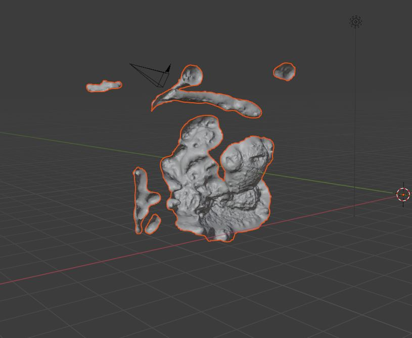
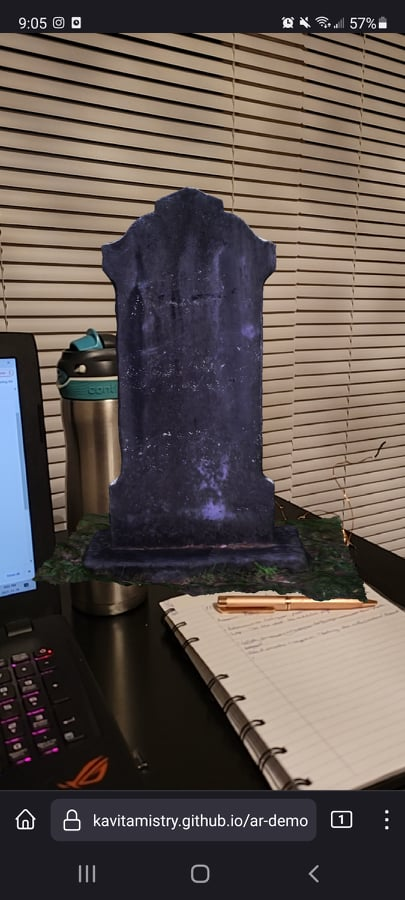
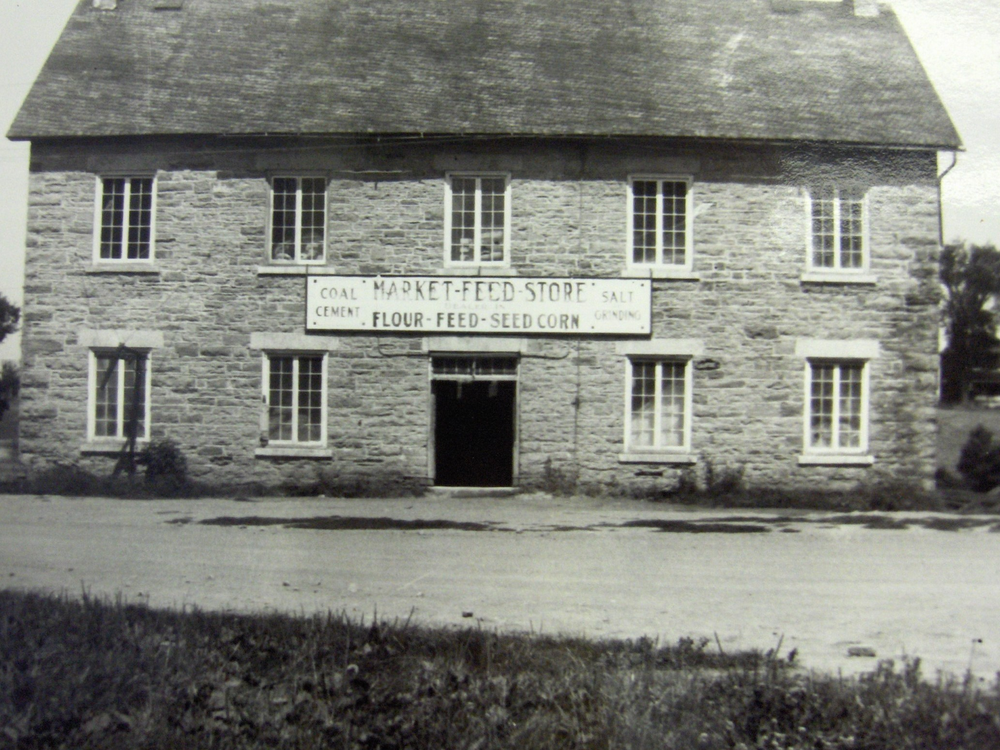

Things are off to a bit of a rocky start. I have the idea in my head and it seems sort of simple based on what we have learned in this class, but things are just not really working out as well as I hoped! 
I decided to work with a dataset that I have access to and am comfortable using, Watson's Mill in Manotick. While I have done extensible projects for this site, one including a 3D reconstruction of the site in 1860, I figured maybe I can toy around with what I already kind of have. 

First off, I started with the AR/VR tutorial on the course webpage. I tried using the awful model I produced  and input it into and AR setting however, when I uploaded the model to Sketchfab, it would not let me download the model because I was using the free version. 

I ended up downloading Professor Graham's model of the gravestone and continued to follow the instructions there. While I was out of the country I thought it would be cool to attempt to input that model at the location I was at, on the beach. Turns out it didn't work as I was hoping, and I got frustrated and gave up. When I came home, I decided to try it again in my home location, and lo and behold...  it worked! Once I figured out how to do that part I figured to go to the next step, which was trying it with my own data. However, that did not work out so well for me and I think I need to look at a new avenue. 

The thought was to get myself familiar with how to do the step above, and try to do that with a historic image. I found an interesting article that basically gives a rundown of what I want to accomplish. [[Riverwalk]](cavallo_riverwalk_ismar_2016.pdf) I have read it, but over the next week I will attempt to follow their steps to see if I can accomplish this task. Right now, I have chosen 1 historic image, of which I will work on getting correct, and then I can move on to another couple images I have access to. The image I am using is of Watson's Mill  in the late 1800s. In the article it talks a lot about alignment and making sure to have a correct positioning to view the image against real time. So I decided to play around with that, and remembered I took a picture in the exact, or what I figured was quite close, area that the historic image was taken, to do a comparison photo. This time I made a gif out of it to show the transformation, and look at the alignment. [[Mill Transformation.gif]] In my opinion, it looked kind of cool. 

Now my next task is to take that historic image, knowing the alignment and positioning, and figure out how to pin it to the location of Watson's Mill so that it can be viewed in AR! Hopefully I can have a better result for next my next Dev Log!
